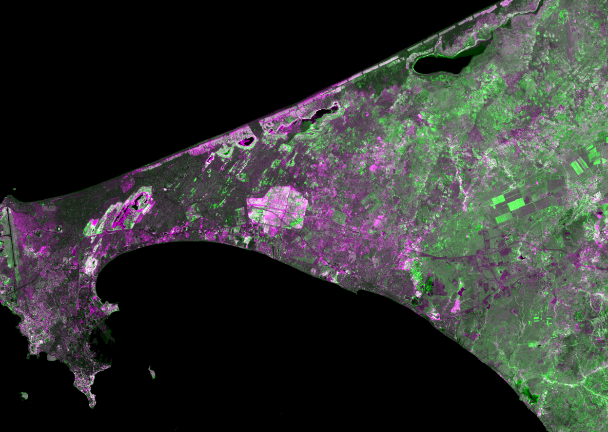

# Historic NDVI Changes with Landsat 4-5TM and Landsat 8
  
<a href="#" id='togglescript'>Show</a> script or [download](script.js){:target="_blank"} it.  

  
  
  
  

  

## Author: 
Monja B. Šebela
  
## Evaluate and visualize  
 - [EO Browser](https://sentinelshare.page.link/cngB)
  
## General description of the script  
  
This script uses data fusion to compare historic with modern imagery by combining Landsat 4-5 TM collection with Landsat 8. NDVI is calculated for both collections, and returned in RGB channels to display changes. In the script output, the newer Landsat 8 NDVI is displayed in the green channel, and the older Landsat 4-5 TM NDVI in both red and blue channels. The resulting RGB image shows green, where vegetation cover was high on a more recent image and low on an older one, thus indicating vegetation cover increase. Pink color indicates high vegetation cover on the older date and low on a newer one, thus indicating reduction in vegetation cover. Vegetation reduction can for example give the user information on urban growth, or deforestation, and increase can indicate agricultural land expansion, or reforestation. Note that dates should be carefully selected, so that data is available, and that both images are taken in the same season, prefferably as close to the same day in a year as possible, to avoid seasonal vegetation changes. 

_Note that in some areas, Landsat 4-5TM images are not georeferenced correctly, and they do not align with Landsat 8 imagery. The script cannot be used in those areas._

## Description of representative images  
  
On this image we can observe the expansion of urban areas where the vegetation cover diminished (pink) and the expansion of agricultural land, where vegetation cover increased (green) over Dakar, between 1990 and 2017. For the earlier image, Landsat 4-5 TM (acquired on 1990-12-05) was used, and for the later image, Landsat 8 (acquired on 2017-12-15) was used.  

 
