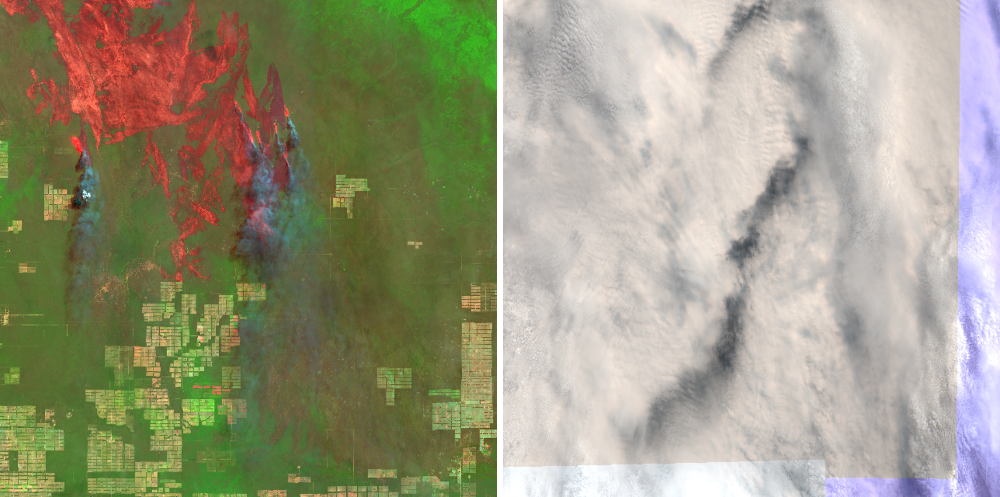
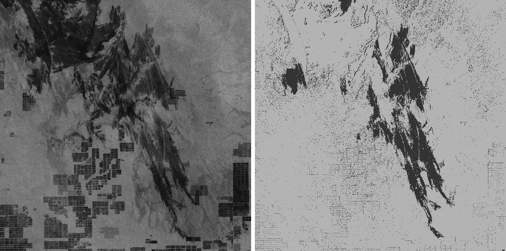

# Mapping forest fire progression with Sentinel-2 and Sentinel-1
  
<a href="#" id='togglescript'>Show</a> script or [download](script.js){:target="_blank"} it.  

  
  
  
  

  
  
## General description of the script  

One big advantage of using data fusion techniques is that the combined sensors can compensate for difficulties of the other.
Especially for the monitoring of dynamic environmental disturbances like forest fires, a data gap would mean uncertainty and could hinder the development of mitigation strategies and delay countermeasures.

Using the example of a forest fire that ravaged the border region of Paraguay and Bolivia in September 2019, we created a multitemporal forest fire progression monitoring script.
The Sentinel-2 [Short wave infrared (SWIR)](https://custom-scripts.sentinel-hub.com/sentinel-2/composites/) composite (Red: Band 12, Green: Band 8, Blue: Band 4) lets us draw conclusions about water content in soil and plants, as water strongly reflects in SWIR wavelengths.
Consequently, the visualisation is very useful for mapping fire damages, e.g. burn scars, because the moisture difference between burned areas and their unaffected surroundings contrasts very well.

Unfavourable weather conditions can disrupt multitemporal analysis of optical data.
In this example, the Sentinel-2 dataset from 7th September 2019 was acquired in perfect conditions, but Sentinel-2 data from the next acquisition date on 12th September 2019 was useless because our area of interest was completely overcast.
The Sentinel-1 SAR was the perfect supplement with its ability to penetrate clouds and the recorded backscatter conveying information about vegetation and soil moisture levels.

Following a methodology developed by Spanish and Australian researchers in 2019 ([Belenguer-Plomer et al. 2019](https://www.sciencedirect.com/science/article/pii/S0034425719303645?via%3Dihub)), a VH backscatter difference layer was created through subtracting VH backscatter image recorded on 7th September 2019 from the second VH backscatter image recorded on 12th September 2019.
Besides the custom script for [Burned Area Visualisation](https://custom-scripts.sentinel-hub.com/sentinel-2/burned_area_ms/), the difference layer served as additional input for the mapping of forest fire progression.

The forest fire progression script produces a fire propagation map where areas that were already burned on 7th September 2019 are coloured in light yellow, and the newly burned areas in red.
By combining data from two different satellite sensors we can avoid data gaps and clearly monitor different development stages of the forest fire, even during highly inconsistent weather conditions.

## Description of representative images  
  
1. Left: S-2 SWIR composite from 7th September 2019 showing the burn scar with active forest fires. Right: a True Color image of the next acquisition date on 12th September 2019 showing completely overcast conditions.
   
2. Left: Sentinel-1 image in VV polarisation mode on 12th September 2019 showing the propagation of the forest fire. Right: the calculated VH backscatter difference layer that was created by subtracting the first from the latter dataset. 
  
3. Fire propagation map depicting previously burned areas from 7 September 2019 in light yellow (analysed with Sentinel-2 data), and newly burned areas in red (analysis based on Sentinel-1 data) on a Sentinel-2 SWIR composite background. 
  

## Contributors:  
Max Kampen
