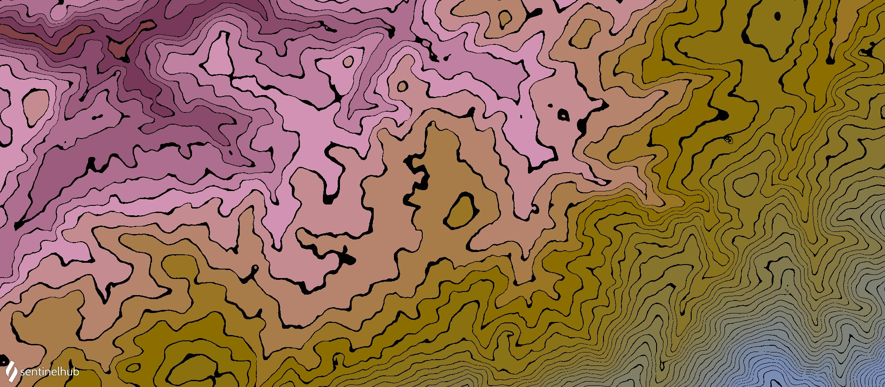
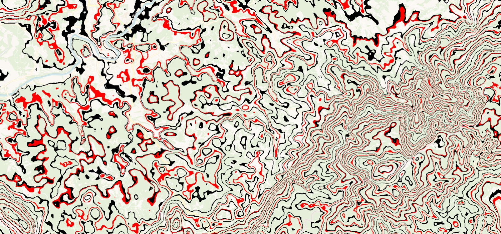
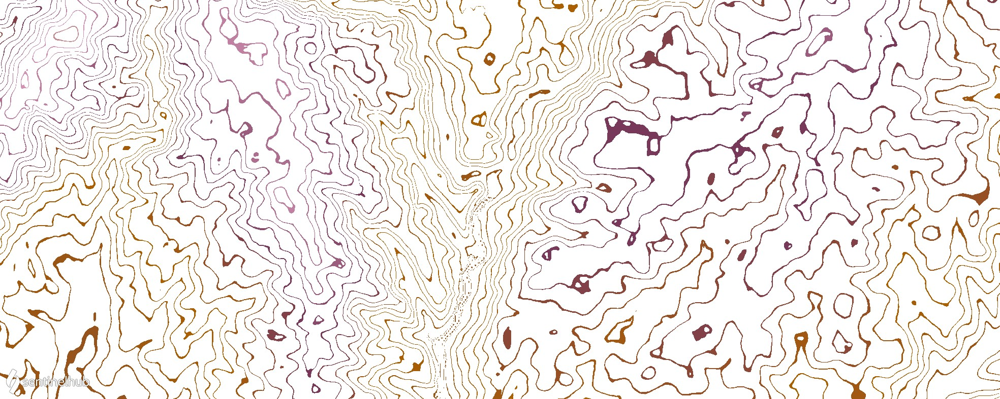

# DEM Contour Lines
<a href="#" id='togglescript'>Show</a> script or [download](script.js){:target="_blank"} it.
<div id='script_view' style="display:none">

      

</div>

## Description

This script uses DEM to calculate and display contour lines. They are calculated using  `c = 20 * Math.floor(d / 20)`. The visualization can be manipulated in a number of ways. The number `35` in the first conditional statement below sets the increments between the contour lines; in this case, the spacing between the contour lines means that the elevation difference between them is 35 meters. This means, that the contour lines will be further apart where the elevation is lower. The number `5` in the script below sets the contour line thickness to be pretty low. The first return statement `return [0,0,0]` sets the color of the contour lines to black, and the colorBlend maps the areas in between in terrain colors, based on the terrain elevation model borders. 

## Representative Images and Examples

### Example 1

The following example will return black contour lines of thickness 5 in 35 meter increments on top of our standard DEM continuous color visualization. 
[View in Sentinel Playground](https://apps.sentinel-hub.com/sentinel-playground/?source=DEM&lat=41.645342272880455&lng=-7.038757314439863&zoom=13&preset=CUSTOM&layers=DEM,DEM,DEM&maxcc=20&gain=1.0&gamma=1.0&time=2019-05-01%7C2019-11-21&atmFilter=&showDates=false&evalscript=dmFyIGQgPSBERU07CmlmIChkICUgMzUgPCA1KSB7CiAgcmV0dXJuIFswLDAsMF0KfQp2YXIgYyA9IDIwICogTWF0aC5mbG9vcihkIC8gMjApOwpyZXR1cm4gY29sb3JCbGVuZChjLCBbLTEyMDAwLC05MDAwLC02MDAwLC0xMDAwLC01MDAsLTIwMCwtNTAsLTIwLC0xMCwwLDEwLDMwLDUwLDIwMCwzMDAsNDAwLDUwMCwxMDAwLDMwMDAsNTAwMCw3MDAwLDkwMDBdLApbWzAuMDAwLCAwLjAwMCwgMC4xNTddLApbMC4xMTgsIDAuMDAwLCAwLjM1M10sClswLjExOCwgMC4xMTgsIDAuNDcxXSwKWzAuMTU3LCAwLjE5NiwgMC43MDZdLApbMC4yMzUsIDAuMjM1LCAwLjkwMl0sClswLjIzNSwgMC4zMTQsIDAuOTYxXSwKWzAuMzUzLCAwLjMzMywgMC45ODBdLApbMC40NzEsIDAuNDcxLCAwLjkyMl0sClswLjYyNywgMC42MjcsIDEuMDAwXSwKWzAuNzg0LCAwLjc4NCwgMC43ODRdLApbMC4zOTIsIDAuMjIwLCAwLjIzNV0sClswLjQ3MSwgMC4xODAsIDAuMTU3XSwKWzAuNTQ5LCAwLjI5OCwgMC4xNTddLApbMC42NjcsIDAuMzc2LCAwLjAwMF0sClswLjQ3MSwgMC4yMjAsIDAuMzUzXSwKWzAuODI0LCAwLjU3MywgMC43MDZdLApbMC41NDksIDAuNDMxLCAwLjAwMF0sClswLjQ3MSwgMC41NDksIDAuNzA2XSwKWzAuNjI3LCAwLjY2NywgMC45NDFdLApbMC43NDUsIDAuNzg0LCAwLjk4MF0sClswLjg2MywgMC45NDEsIDEuMDAwXSwKWzEuMDAwLCAxLjAwMCwgMS4wMDBdXSk%3D)

```javascript
var d = DEM;
if (d % 35 < 5) {
  return [0,0,0]
}
var c = 20 * Math.floor(d / 20);
return colorBlend(c, [-12000,-9000,-6000,-1000,-500,-200,-50,-20,-10,0,10,30,50,200,300,400,500,1000,3000,5000,7000,9000],
[[0.000, 0.000, 0.157],
[0.118, 0.000, 0.353],
[0.118, 0.118, 0.471],
[0.157, 0.196, 0.706],
[0.235, 0.235, 0.902],
[0.235, 0.314, 0.961],
[0.353, 0.333, 0.980],
[0.471, 0.471, 0.922],
[0.627, 0.627, 1.000],
[0.784, 0.784, 0.784],
[0.392, 0.220, 0.235],
[0.471, 0.180, 0.157],
[0.549, 0.298, 0.157],
[0.667, 0.376, 0.000],
[0.471, 0.220, 0.353],
[0.824, 0.573, 0.706],
[0.549, 0.431, 0.000],
[0.471, 0.549, 0.706],
[0.627, 0.667, 0.941],
[0.745, 0.784, 0.980],
[0.863, 0.941, 1.000],
[1.000, 1.000, 1.000]])
```



### Example 2

We can make multiple contour lines, each in different increments and different color. It's also possible to return all other values transparent, so that contour lines can be downloaded and overlayed over other datasets. The following example returns 35 meter contour lines in black, 50 meter contour lines in red and all other pixels transparent. On the image, you can see Carto Voyager basemap under the contour lines. 

To display this script, either use a processing API, or EO Browser. In EO Browser, data fusion needs to be used to access DEM dataset. [See it in EO Browser](https://apps.sentinel-hub.com/eo-browser/?zoom=13&lat=45.76735&lng=15.28576&themeId=DEFAULT-THEME&datasetId=S2L2A&fromTime=2020-09-30T00%3A00%3A00.000Z&toTime=2020-09-30T23%3A59%3A59.999Z&visualizationUrl=https%3A%2F%2Fservices.sentinel-hub.com%2Fogc%2Fwms%2Fbd86bcc0-f318-402b-a145-015f85b9427e&evalscript=Ci8vVkVSU0lPTj0zCi8vQXV0aG9yOiBNb25qYSBCLiDFoGViZWxhCgpmdW5jdGlvbiBzZXR1cCgpIHsKICByZXR1cm4gewogIAlpbnB1dDogWwogICAgCXtkYXRhc291cmNlOiAiUzJMMkEiLCBiYW5kczpbIkIwNCIsICJCMDMiLCAiQjAyIl19LAogICAgCXtkYXRhc291cmNlOiAiREVNIiwgYmFuZHM6WyJERU0iXX1dLAogIAlvdXRwdXQ6IFsKICAgIAl7aWQ6ICJkZWZhdWx0IiwgYmFuZHM6IDR9CiAgCV0KICB9Owp9CgpmdW5jdGlvbiBldmFsdWF0ZVBpeGVsKHNhbXBsZXMsIGlucHV0RGF0YSwgaW5wdXRNZXRhZGF0YSwgY3VzdG9tRGF0YSwgb3V0cHV0TWV0YWRhdGEpewogICAgdmFyIFMyID0gc2FtcGxlcy5TMkwyQVswXQogICAgdmFyIERFTU0gPSBzYW1wbGVzLkRFTVswXQogICAgdmFyIERFTSA9IERFTU0uREVNCgogICAgdmFyIGQgPSBERU07CmlmIChkICUgMzUgPCA1KSB7CiAgcmV0dXJuIFswLDAsMCwxXQp9CiAgaWYgKGQgJSA1MCA8IDUpIHsKICByZXR1cm4gWzEsMCwwLDFdCn0KCmVsc2V7CiAgcmV0dXJuIFswLDAsMCwwXQp9Cn0KICA%3D&dataFusion=%5B%7B%22id%22%3A%22AWS_S2L2A%22%2C%22alias%22%3A%22S2L2A%22%7D%2C%7B%22id%22%3A%22AWS_DEM%22%2C%22alias%22%3A%22DEM%22%7D%5D#custom-script).

```javascript
var d = DEM;
if (d % 35 < 5) {
  return [0,0,0,1]
}
if (d % 50 < 5) {
  return [1,0,0,1]
}
else{
  return [0,0,0,0]
}
```



### Example 3

Making contour lines very thick makes and returning them in a color, in this case white, while returning everything else with a color visualization, gives the impression of colored contour lines on a white background. 

[View in Sentinel Playground](https://apps.sentinel-hub.com/sentinel-playground/?source=DEM&lat=40.44593462678334&lng=-8.156147003173828&zoom=14&preset=CUSTOM&layers=DEM,DEM,DEM&maxcc=20&gain=1.0&gamma=1.0&time=2019-05-01%7C2019-11-21&atmFilter=&showDates=false&evalscript=dmFyIGQgPSBERU07CmlmIChkICUgMjAgPCAxOCkgewogIHJldHVybiBbMSwxLDFdCn0KdmFyIGMgPSAyMCAqIE1hdGguZmxvb3IoZCAvIDIwKTsKcmV0dXJuIGNvbG9yQmxlbmQoYywgWy0xMjAwMCwtOTAwMCwtNjAwMCwtMTAwMCwtNTAwLC0yMDAsLTUwLC0yMCwtMTAsMCwxMCwzMCw1MCwyMDAsMzAwLDQwMCw1MDAsMTAwMCwzMDAwLDUwMDAsNzAwMCw5MDAwXSwKW1swLjAwMCwgMC4wMDAsIDAuMTU3XSwKWzAuMTE4LCAwLjAwMCwgMC4zNTNdLApbMC4xMTgsIDAuMTE4LCAwLjQ3MV0sClswLjE1NywgMC4xOTYsIDAuNzA2XSwKWzAuMjM1LCAwLjIzNSwgMC45MDJdLApbMC4yMzUsIDAuMzE0LCAwLjk2MV0sClswLjM1MywgMC4zMzMsIDAuOTgwXSwKWzAuNDcxLCAwLjQ3MSwgMC45MjJdLApbMC42MjcsIDAuNjI3LCAxLjAwMF0sClswLjc4NCwgMC43ODQsIDAuNzg0XSwKWzAuMzkyLCAwLjIyMCwgMC4yMzVdLApbMC40NzEsIDAuMTgwLCAwLjE1N10sClswLjU0OSwgMC4yOTgsIDAuMTU3XSwKWzAuNjY3LCAwLjM3NiwgMC4wMDBdLApbMC40NzEsIDAuMjIwLCAwLjM1M10sClswLjgyNCwgMC41NzMsIDAuNzA2XSwKWzAuNTQ5LCAwLjQzMSwgMC4wMDBdLApbMC40NzEsIDAuNTQ5LCAwLjcwNl0sClswLjYyNywgMC42NjcsIDAuOTQxXSwKWzAuNzQ1LCAwLjc4NCwgMC45ODBdLApbMC44NjMsIDAuOTQxLCAxLjAwMF0sClsxLjAwMCwgMS4wMDAsIDEuMDAwXV0p)



### Example 4

It is also possible to return contour lines of any color on top of a true color visualization of anoter satellite. However, for this, data fusion is needed. In the example below, Landsat 8 true color visualization was used under white contour lines. 

[DEM contour lines over Landsat 8 data fusion script](https://custom-scripts.sentinel-hub.com/data-fusion/dem_contour_over_l8/)


## Authors of the scripts

- Peter Gabrovšek
- Marko Repše
- Monja Šebela


 
