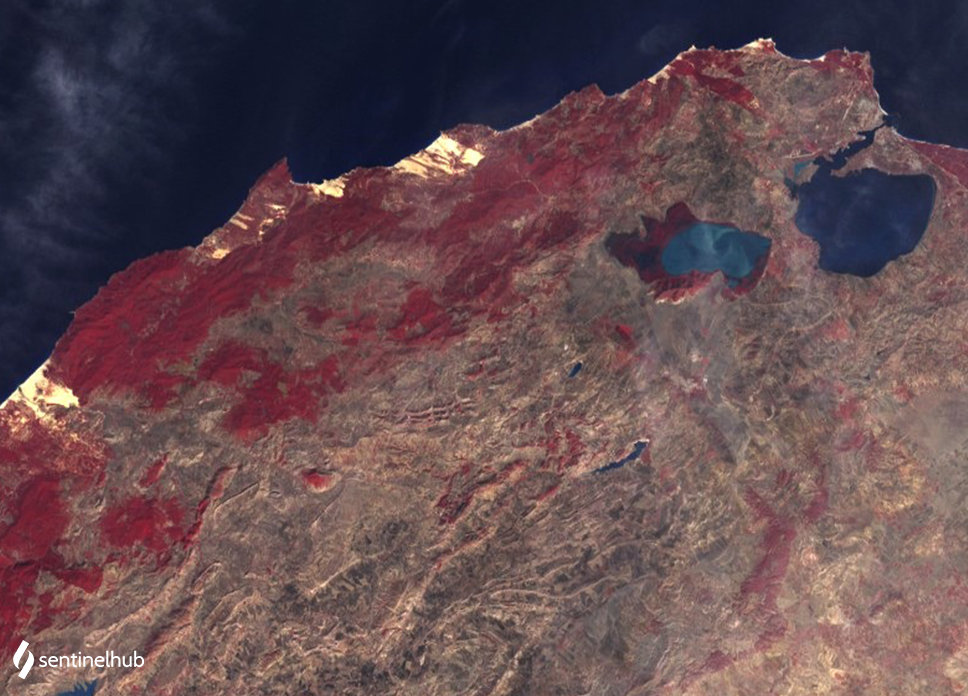

# False Color Ultra Red Composite

<a href="#" id='togglescript'>Show</a> script or [download](script.js){:target="_blank"} it.


      


## General description of the script

This is a simple RGB composite with NIR band B03 (700 - 800 nm) in the red channel, red band B02 in the green channel and green band B01 in the blue channel. The script is useful for plant density and health monitoring, as vegetation heavily reflects NIR light while absorbing red. It is commonly used to distinguish between land and water. Vegetation appears red, cities and exposed ground are grey or tan, and water appears blue or black. 

## Description of representative images

The False Color Ultra Red Composite in northern Tunisia. Acquired on 1987-10-15.

## References

[4] [LANDSAT 5 (MSS) IMAGERY. Earth Observation System](https://eos.com/find-satellite/landsat-5-mss/){:target="_blank"}