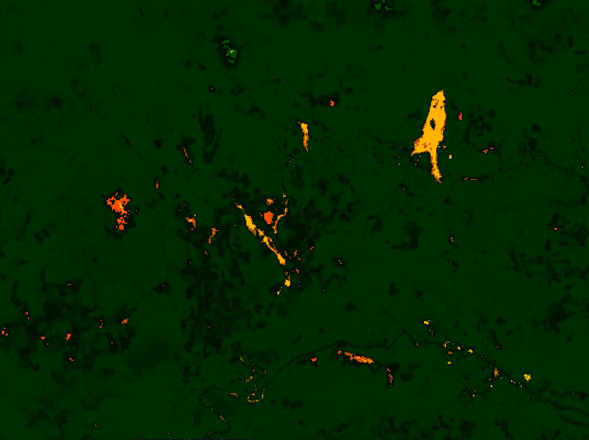
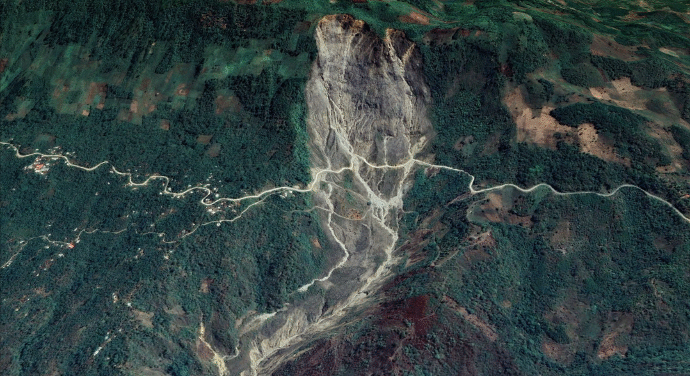
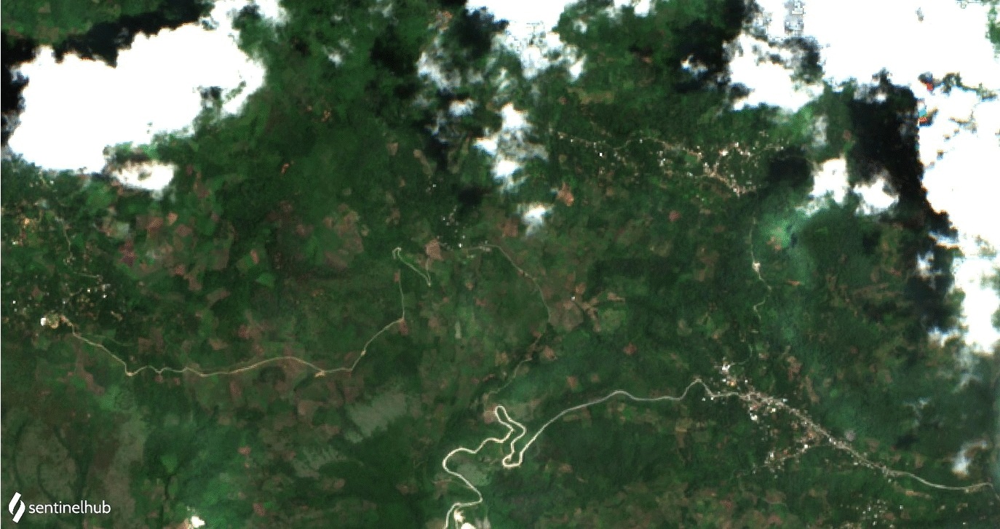

# Landslide Detection for Rapid Mapping Using Sentinel 2

<a href="#" id='togglescript'>Show</a> script or [download](script.js){:target="_blank"} it.


      


## Evaluate and visualize

 - [Sentinel Playground](https://apps.sentinel-hub.com/sentinel-playground/?source=S2L2A&lat=15.38928749640127&lng=-90.63991069793701&zoom=15&preset=CUSTOM&layers=B01,B02,B03&maxcc=100&gain=1.0&gamma=1.0&time=2020-05-01%7C2020-11-11&atmFilter=&showDates=false&evalscript=Ly9WRVJTSU9OPTMuTGFuZHNsaWRlX2RldGVjdGlvbi5VTlNQSURFUgoKLy9ieSBOb3JtYSBkYXZpbGEgJiBBbGV4YW5kZXIgQXJpemEKCmZ1bmN0aW9uIHNldHVwKCkgewogIHJldHVybiB7CiAgICBpbnB1dDogWyJCMDIiLCAiQjAzIiwgIkIwNCIsICJCMDgiLCAiQjExIiwiQ0xNIl0sCiAgICBvdXRwdXQ6IHsgYmFuZHM6IDMgfSwKICAgIAogIH07Cn0KZnVuY3Rpb24gc3RyZXRjaCh2YWwsIG1pbiwgbWF4KSB7cmV0dXJuICh2YWwgLSBtaW4pIC8gKG1heCAtIG1pbik7fQpmdW5jdGlvbiBldmFsdWF0ZVBpeGVsKHNhbXBsZSkgewogIHZhciBic2kgPSAoKHNhbXBsZS5CMTEgKyBzYW1wbGUuQjA0KS0oc2FtcGxlLkIwOCArIHNhbXBsZS5CMDIpKS8oKHNhbXBsZS5CMTEgKyBzYW1wbGUuQjA0KSsoc2FtcGxlLkIwOCArIHNhbXBsZS5CMDIpKTsKICB2YXIgTkRWSSA9IGluZGV4KHNhbXBsZS5CMDgsIHNhbXBsZS5CMDQpOwogIHZhciBORFdJPWluZGV4KHNhbXBsZS5CMDMsc2FtcGxlLkIwOCk7CiAgICAgICAgaWYgKHNhbXBsZS5DTE0gPT0gMSkgewogICAgcmV0dXJuIFtzYW1wbGUuQjA0LAogICAgICAgICAgICBzYW1wbGUuQjAzLAogICAgICAgICAgICAzKnNhbXBsZS5CMDJdCn0KICAKaWYgKE5EV0kgPiAwLjE1KSB7CiByZXR1cm4gWzAsIDAuMiwgMS4wKk5EV0ldCn0KaWYoKHNhbXBsZS5CMTE%2BMC44KXx8KE5EVkk8MC4xNSkpewogIHJldHVyblsxLjUsMC43LC0xXQp9ICAKaWYgKE5EVkk%2BMC4yNSl7CiAgcmV0dXJuIFswICwgMC4yKk5EVkksIDBdCn0KZWxzZSB7CiByZXR1cm4gWzMuNSpic2ksIDAuMywgMF0KfQoKfQo%3D){:target="_blank"}
 - [EO Browser](https://apps.sentinel-hub.com/eo-browser/?zoom=15&lat=15.37373&lng=-90.5406&themeId=DEFAULT-THEME&datasetId=S2L2A&fromTime=2020-11-10T00%3A00%3A00.000Z&toTime=2020-11-10T23%3A59%3A59.999Z&visualizationUrl=https%3A%2F%2Fservices.sentinel-hub.com%2Fogc%2Fwms%2Fbd86bcc0-f318-402b-a145-015f85b9427e&evalscript=Ly9WRVJTSU9OPTMuTGFuZHNsaWRlX2RldGVjdGlvbi5VTlNQSURFUgoKLy9ieSBOb3JtYSBkYXZpbGEgJiBBbGV4YW5kZXIgQXJpemEKCmZ1bmN0aW9uIHNldHVwKCkgewogIHJldHVybiB7CiAgICBpbnB1dDogWyJCMDIiLCAiQjAzIiwgIkIwNCIsICJCMDgiLCAiQjExIiwiQ0xNIl0sCiAgICBvdXRwdXQ6IHsgYmFuZHM6IDMgfSwKICAgIAogIH07Cn0KZnVuY3Rpb24gc3RyZXRjaCh2YWwsIG1pbiwgbWF4KSB7cmV0dXJuICh2YWwgLSBtaW4pIC8gKG1heCAtIG1pbik7fQpmdW5jdGlvbiBldmFsdWF0ZVBpeGVsKHNhbXBsZSkgewogIHZhciBic2kgPSAoKHNhbXBsZS5CMTEgKyBzYW1wbGUuQjA0KS0oc2FtcGxlLkIwOCArIHNhbXBsZS5CMDIpKS8oKHNhbXBsZS5CMTEgKyBzYW1wbGUuQjA0KSsoc2FtcGxlLkIwOCArIHNhbXBsZS5CMDIpKTsKICB2YXIgTkRWSSA9IGluZGV4KHNhbXBsZS5CMDgsIHNhbXBsZS5CMDQpOwogIHZhciBORFdJPWluZGV4KHNhbXBsZS5CMDMsc2FtcGxlLkIwOCk7CiAgICAgICAgaWYgKHNhbXBsZS5DTE0gPT0gMSkgewogICAgcmV0dXJuIFtzYW1wbGUuQjA0LAogICAgICAgICAgICBzYW1wbGUuQjAzLAogICAgICAgICAgICAzKnNhbXBsZS5CMDJdCn0KICAKaWYgKE5EV0kgPiAwLjE1KSB7CiByZXR1cm4gWzAsIDAuMiwgMS4wKk5EV0ldCn0KaWYoKHNhbXBsZS5CMTE%2BMC44KXx8KE5EVkk8MC4xNSkpewogIHJldHVyblsxLjUsMC43LC0xXQp9ICAKaWYgKE5EVkk%2BMC4yNSl7CiAgcmV0dXJuIFswICwgMC4yKk5EVkksIDBdCn0KZWxzZSB7CiByZXR1cm4gWzMuNSpic2ksIDAuMywgMF0KfQoKfQoK){:target="_blank"} 

## General description of the script

This repository is a custom script explained for detecting landslides using space-based data on Sentinel Playground and EO Browser. Its goal is to facilitate the landslide inventory and rapid mapping in disaster management.

## Details of the script

The script to landslide detection for rapid mapping is based on the response of the Barren Soil Index BSI to detect recent traces of soil movements. The results allow us to extract the shapes of the landslides in the terrain and to calculate their direction of movement. In the same way, The script uses the NDWI, NDVI, and B11 for differentiating between water with sediment, built-up areas, barren areas and vegetated areas. The image obtained show the landslides and barren soil brown color, the water blue tones depending on sediments load, built-up areas orange-yellow, and vegetation and other covers in dark green. All pixels related to landslide or barren soil corresponding to values that B11 lower than 0.8 of reflectivity or NDVI values greater than 0.15, returning the BSI in the red and green channel (showing in brown to orange); the rest of the values are linked with built-up and urban areas (showing in orange to yellow); other pixels with NDVI values greater than 0.25 are associated to vegetation (showing NDVI in the green channel). Finally, pixels with NDWI values greater than 0.15 are considered as water, that depending on the sediment load will appear in blue tones.

The first script version confused the high reflectivity of clouds with the bare soil; for this reason, the new script includes a Cloud mask computed using the CLP (cloud probabilities) of s2cloudless, which are available at Sentinel Hub. The script returns three bands (R/G/B and CLM) will result in a real image, as well as the fraction of cloudy pixels per each observation.

See also [author's GitHub repository](https://github.com/Alexanderariza/Landslide_detection){:target="_blank"} for more information.

## Authors of the script

Alexander Ariza, Norma Davila (normadavilahernandez@gmail.com)

## Description of representative images

The outcomes are shown according to R:G:B composite image where the yellow color represents bare soils, while orange and brown colors are linked to surficial soils or debris slides, which have suffered a remotion or emplacement motion. Particularly, for an active landslide, both colors matching with vertical erosion towards the proximal area of the landslide (headwerd) or over talud deposits.

The preliminary results showed that the use of BSI, NDVI and NDWI in combination with the B11 reflectance are sufficient to identify recent traces of soil movements useful for rapid mapping response during a disaster event. In this case, the use of the BSI index itself has not able to characterize the landslide configurations on terrain, due to after landslide event, the spectral response change shortly especially over zones with fast reactivation in the vegetation cover. Therefore, in order to improve the interpretation of the results, we recommended a temporal analysis (pre and post events) to get better outcomes of BSI values linked to landslide targets.

**Landslide detection for rapid mapping KML layer exported from [EO Browser](https://apps.sentinel-hub.com/eo-browser/?zoom=16&lat=15.37631&lng=-90.53612&themeId=DEFAULT-THEME&datasetId=S2L2A&fromTime=2020-11-10T00%3A00%3A00.000Z&toTime=2020-11-10T23%3A59%3A59.999Z&visualizationUrl=https%3A%2F%2Fservices.sentinel-hub.com%2Fogc%2Fwms%2Fbd86bcc0-f318-402b-a145-015f85b9427e&evalscript=Ly9WRVJTSU9OPTMuTGFuZHNsaWRlX2RldGVjdGlvbi5VTlNQSURFUgoKLy9ieSBOb3JtYSBkYXZpbGEgJiBBbGV4YW5kZXIgQXJpemEKCmZ1bmN0aW9uIHNldHVwKCkgewogIHJldHVybiB7CiAgICBpbnB1dDogWyJCMDIiLCAiQjAzIiwgIkIwNCIsICJCMDgiLCAiQjExIiwiQ0xNIl0sCiAgICBvdXRwdXQ6IHsgYmFuZHM6IDMgfSwKICAgIAogIH07Cn0KZnVuY3Rpb24gc3RyZXRjaCh2YWwsIG1pbiwgbWF4KSB7cmV0dXJuICh2YWwgLSBtaW4pIC8gKG1heCAtIG1pbik7fQpmdW5jdGlvbiBldmFsdWF0ZVBpeGVsKHNhbXBsZSkgewogIHZhciBic2kgPSAoKHNhbXBsZS5CMTEgKyBzYW1wbGUuQjA0KS0oc2FtcGxlLkIwOCArIHNhbXBsZS5CMDIpKS8oKHNhbXBsZS5CMTEgKyBzYW1wbGUuQjA0KSsoc2FtcGxlLkIwOCArIHNhbXBsZS5CMDIpKTsKICB2YXIgTkRWSSA9IGluZGV4KHNhbXBsZS5CMDgsIHNhbXBsZS5CMDQpOwogIHZhciBORFdJPWluZGV4KHNhbXBsZS5CMDMsc2FtcGxlLkIwOCk7CiAgICAgICAgaWYgKHNhbXBsZS5DTE0gPT0gMSkgewogICAgcmV0dXJuIFtzYW1wbGUuQjA0LAogICAgICAgICAgICBzYW1wbGUuQjAzLAogICAgICAgICAgICAzKnNhbXBsZS5CMDJdCn0KICAKaWYgKE5EV0kgPiAwLjE1KSB7CiByZXR1cm4gWzAsIDAuMiwgMS4wKk5EV0ldCn0KaWYoKHNhbXBsZS5CMTE%2BMC44KXx8KE5EVkk8MC4xNSkpewogIHJldHVyblsxLjUsMC43LC0xXQp9ICAKaWYgKE5EVkk%2BMC4yNSl7CiAgcmV0dXJuIFswICwgMC4yKk5EVkksIDBdCn0KZWxzZSB7CiByZXR1cm4gWzMuNSpic2ksIDAuMywgMF0KfQoKfQoK#custom-script) over 3D model in Google Earth**

**Sentinel 2 image acquired by 01/09/2020 before landslide events in Queja - Alta Verapaz comparing spectral indexes on bare soils**

**Sentinel 2 image acquired by 10/11/2020 after landslide events in Queja - Alta Verapaz comparing spectral indexes on bare soils**

Limitations exist when the script trying to separate barren soil from buildings and urban areas, due to a similar spectral response. Therefore, this script gets better results in rural regions along roads and built-up emplaced on steep slopes, where the landslides occurrence currently; facilitating the rapid mapping of landslides in case of disasters. For future improvements, we recommend the use of a digital elevation model as a mask to get better landslides discrimination concerning other covers.

**Landslide detection for rapid mapping KML layer exported from [EO Browser](https://apps.sentinel-hub.com/eo-browser/?zoom=15&lat=15.39125&lng=-90.63712&themeId=DEFAULT-THEME&datasetId=S2L2A&fromTime=2020-11-10T00%3A00%3A00.000Z&toTime=2020-11-10T23%3A59%3A59.999Z&visualizationUrl=https%3A%2F%2Fservices.sentinel-hub.com%2Fogc%2Fwms%2Fbd86bcc0-f318-402b-a145-015f85b9427e&evalscript=Ly9WRVJTSU9OPTMuTGFuZHNsaWRlX2RldGVjdGlvbi5VTlNQSURFUgoKLy9ieSBOb3JtYSBkYXZpbGEgJiBBbGV4YW5kZXIgQXJpemEKCmZ1bmN0aW9uIHNldHVwKCkgewogIHJldHVybiB7CiAgICBpbnB1dDogWyJCMDIiLCAiQjAzIiwgIkIwNCIsICJCMDgiLCAiQjExIiwiQ0xNIl0sCiAgICBvdXRwdXQ6IHsgYmFuZHM6IDMgfSwKICAgIAogIH07Cn0KZnVuY3Rpb24gc3RyZXRjaCh2YWwsIG1pbiwgbWF4KSB7cmV0dXJuICh2YWwgLSBtaW4pIC8gKG1heCAtIG1pbik7fQpmdW5jdGlvbiBldmFsdWF0ZVBpeGVsKHNhbXBsZSkgewogIHZhciBic2kgPSAoKHNhbXBsZS5CMTEgKyBzYW1wbGUuQjA0KS0oc2FtcGxlLkIwOCArIHNhbXBsZS5CMDIpKS8oKHNhbXBsZS5CMTEgKyBzYW1wbGUuQjA0KSsoc2FtcGxlLkIwOCArIHNhbXBsZS5CMDIpKTsKICB2YXIgTkRWSSA9IGluZGV4KHNhbXBsZS5CMDgsIHNhbXBsZS5CMDQpOwogIHZhciBORFdJPWluZGV4KHNhbXBsZS5CMDMsc2FtcGxlLkIwOCk7CiAgICAgICAgaWYgKHNhbXBsZS5DTE0gPT0gMSkgewogICAgcmV0dXJuIFtzYW1wbGUuQjA0LAogICAgICAgICAgICBzYW1wbGUuQjAzLAogICAgICAgICAgICAzKnNhbXBsZS5CMDJdCn0KICAKaWYgKE5EV0kgPiAwLjE1KSB7CiByZXR1cm4gWzAsIDAuMiwgMS4wKk5EV0ldCn0KaWYoKHNhbXBsZS5CMTE%2BMC44KXx8KE5EVkk8MC4xNSkpewogIHJldHVyblsxLjUsMC43LC0xXQp9ICAKaWYgKE5EVkk%2BMC4yNSl7CiAgcmV0dXJuIFswICwgMC4yKk5EVkksIDBdCn0KZWxzZSB7CiByZXR1cm4gWzMuNSpic2ksIDAuMywgMF0KfQoKfQoK#custom-script) over 3D model in Google Earth**

## References

[1] Ariza Ortiz, A., Roa Melgarejo, O. J., Serrato, P. K., & LeÛn RincÛn, H. A. (2018). Using spectral ratios derived from remote sensing to geomorphological surveys in island areas of the Colombian Caribbean. Perspectiva Geogr·fica. [Link](https://doi.org/10.19053/01233769.5863)

[2] D·vila-Hern·ndez, N., Lira, J., Capra-Pedol, L., & Zucca, F. (2011). A normalized difference lahar index based on Terra/Aster and Spot 5 images: An application at Colima Volcano, Mexico. Revista Mexicana de Ciencias Geologicas.

## Credits

For the Landslide detection script the Barren soil index BSI and the a version modified of Urban Classification proposed by Monja Šebela was used.